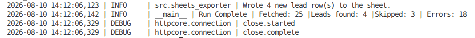
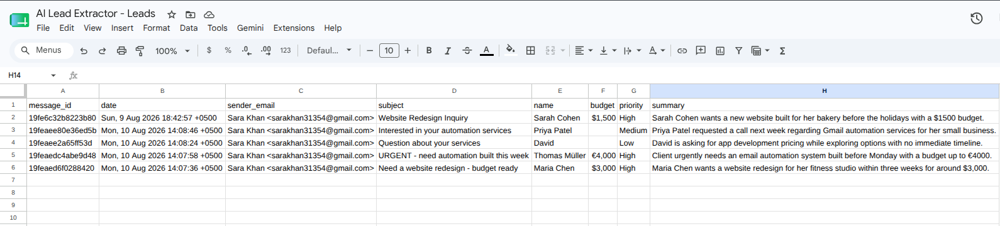
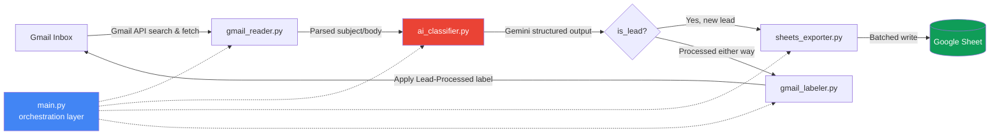

# AI-Powered Gmail Lead Extractor & Classifier

Automatically scans a Gmail inbox, uses an LLM to identify and extract genuine sales leads (name, email, budget, priority) from raw email threads, and logs them into a Google Sheet — with zero duplicate processing and zero paid infrastructure.





---

## Why This Exists

Small businesses and freelancers routinely lose leads in a crowded inbox — a promising client inquiry gets buried between newsletters and receipts within hours. This project builds a fully automated pipeline that reads new emails, uses an LLM with **schema-constrained structured output** (not fragile regex parsing) to determine whether an email is a genuine lead, extracts key fields, and writes them to a spreadsheet — while marking each email so it's never processed twice.

Built entirely on **free-tier tools**: Gmail API, Google Sheets API, and Google's Gemini API free tier.

---

## Features

- **Secure OAuth2 authentication** — no passwords stored, ever; token refresh handled automatically for unattended runs
- **Robust MIME parsing** — recursively handles multipart emails, with an HTML-to-text fallback for HTML-only messages
- **Schema-enforced AI extraction** — Gemini's structured output guarantees valid JSON every time, no parsing hacks
- **Batched Google Sheets export** — stays well within API rate limits even on large inboxes
- **Idempotent by design** — Gmail labels act as a state machine, so re-running the script never creates duplicate leads
- **Production-grade logging** — every run writes a timestamped audit trail to `pipeline.log`
- **Three-layer error handling** — a single malformed email can never crash a batch run
- **CLI-configurable** — adjust search windows and batch sizes without touching code

---

## Architecture



**Pipeline flow:** `main.py` orchestrates five independent, single-responsibility modules — each one testable in isolation, none of them aware of the others' internals.

---

## Tech Stack

| Layer | Tool | Why |
|---|---|---|
| Language | Python 3.11+ | Type hints, modern stdlib |
| Auth | Google OAuth2 (`google-auth-oauthlib`) | Secure, no stored passwords |
| Email | Gmail API | Native search syntax, label-based state |
| AI | Gemini API (`google-genai`) | Free-tier structured output, no parsing hacks |
| Validation | Pydantic v2 | Single schema for AI output + data validation |
| Storage | Google Sheets (`gspread`) | Zero-setup, client-friendly output format |
| Config | `python-dotenv` | No secrets hardcoded in source |

---

## Getting Started

### Prerequisites
- Python 3.11+
- A Google account
- 5 minutes to set up free API credentials

### 1. Clone & install
```bash
git clone https://github.com/SaraKhan-24/GmailLeadExtractor.git
cd gmail-lead-extractor
pip install -r requirements.txt
```

### 2. Google Cloud setup
1. Create a project at [console.cloud.google.com](https://console.cloud.google.com/)
2. Enable the **Gmail API** and **Google Sheets API**
3. Configure the OAuth consent screen (Auth Platform → add yourself as a test user)
4. Create an **OAuth Client ID** (Desktop app type) → download as `credentials.json` → place in project root

### 3. Get a free Gemini API key
1. Visit [aistudio.google.com](https://aistudio.google.com/) → **Get API Key**

### 4. Configure environment
```bash
cp .env.example .env
```
Fill in `.env`:
```env
GOOGLE_CREDENTIALS_PATH=credentials.json
GOOGLE_TOKEN_PATH=token.json
GMAIL_SCOPES=https://www.googleapis.com/auth/gmail.readonly,https://www.googleapis.com/auth/gmail.modify,https://www.googleapis.com/auth/spreadsheets
GEMINI_API_KEY=your_key_here
GEMINI_MODEL_NAME=gemini-flash-latest
GOOGLE_SHEET_NAME=AI Lead Extractor - Leads
GMAIL_PROCESSED_LABEL=Lead-Processed
```

### 5. Run it
```bash
python main.py --verbose
```
On first run, a browser window opens for Google login/consent. After that, it runs unattended.

---

## Usage

```bash
# Default: scan the last 30 days, up to 25 unprocessed emails
python main.py

# Custom search window and batch size
python main.py --query-extra "newer_than:7d" --max-results 50

# Verbose debug logging
python main.py --verbose
```

---

## Project Structure

```
gmail-lead-extractor/
├── main.py                  # Orchestration layer — entry point
├── requirements.txt
├── .env.example
├── src/
│   ├── config.py             # Centralized environment config
│   ├── auth.py                # OAuth2 lifecycle management
│   ├── gmail_reader.py        # Email fetching & MIME parsing
│   ├── ai_classifier.py       # Gemini structured-output extraction
│   ├── gmail_labeler.py       # Label-based dedup state machine
│   └── sheets_exporter.py     # Batched Google Sheets writes
└── pipeline.log              # Generated at runtime (gitignored)
```

---

## Error Handling & Logging

This pipeline uses **three layers of error handling** so a single bad email never takes down a full run:

1. **Function-level** — API calls in `gmail_reader.py` and `ai_classifier.py` catch their own failures and return `None` rather than raising.
2. **Loop-level** — `main.py` wraps each email's processing individually; one failure is logged and the batch continues.
3. **Top-level** — configuration errors (bad API key, missing credentials) fail fast with a clean message and exit code, not a raw traceback.

Every run appends to `pipeline.log` with timestamps and severity levels — a full audit trail for debugging or scheduled/unattended runs.

---

## Roadmap

- [ ] Slack/email notification summarizing each run
- [ ] Support for multiple inboxes via a config list
- [ ] Dockerfile for one-command deployment
- [ ] Scheduled execution via GitHub Actions cron

---

## License

MIT — see [LICENSE](LICENSE) for details.

## Author

Built by **Sara Khan** as a portfolio project demonstrating production-grade Python automation, OAuth2 integration, and LLM structured-output engineering.
